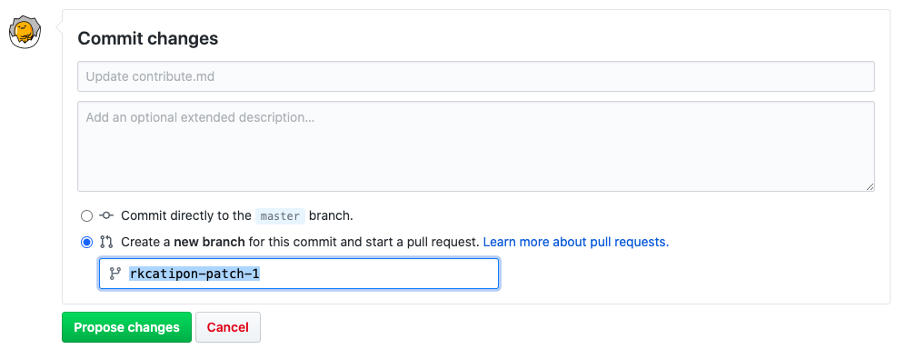

.. _Contribute:

#################
How to Contribute
#################

Collecting and cleaning text can be time-consuming. We've created a list of corpora, text cleaning tools, and code to make NLP pre-processing easier -- but we need your help! With your contributions, our list of resources can grow and be shared with the NLP community. 

Contribute transformations
^^^^^^^^^^^^^^^^^^^^^^^^^^^

The list of transformations on Texti has been developed and curated by the SAGE Ocean Fellows, and we invite you to comment and add your own transformations that you believe others will benefit from. 

.. note::
You can add your own transformations through a pull request with this `template <https://github.com/sagepublishing/text_cleaning/blob/master/.github/pull_request_template.md>`_

If you have ideas for transformations that would be useful, or that you might need, but don't know (or don't have the time) to wrrite the python code, then please raise an issue on this github repository, and we will take a look and prioritize it. If you want to see the transformations we are working on right now, head to the 'Project' tab on the repository and click into the kanban board.

Contribute to the resources
^^^^^^^^^^^^^^^^^^^^^^^^^^^

The resources (corpora, packages and other useful links) have been collated by the project team based on many of your suggestions and a lot of desk research. We would like to keep the resources up to date and invite your input.
If you would like to contribute a corpus, head to the corresponding resources.rst file in /source folder. From there you can add your listing by clicking on the edit button in the top-right corner.
Please note, the corpora on this page should be related to political science, but the region and what aspect of political science it encapsulates is up to you. 

.. image:: make_changes.png

Click on the edit button to add information.

Now you can edit in rst, and add rows to the table. After you make your changes you can preview and then commit the changes. At the bottom you will find a space to add a file change message. Add a name for the change, and let us know ifyou would like to "Create a new branch for this commit and start a pull request". Once you do, please click on "Propose file change".

The format of the entry should match the headings of the table and include the same information:

.. list-table::
   :header-rows: 1

   * - Item
     - Country
     - Description
     - Access
     - Link
   * - Name of the corpora
     - Country or region
     - Number of observations or type of data
     - Bulk download, API, csv, etc.
     - url
